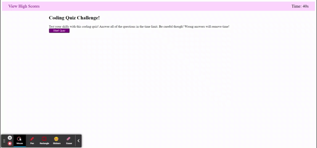

# homework_04
UCSD Web Developer Bootcamp Section 4 Mini Project
The goal of this project was to use dynamic Javascript and browser APIs to create a coding quiz. It would include tracked results and bt timed.

The finished product is available here: https://windwalker-92.github.io/homework_04/

To accomplish the dynamic loading, I had an empty section in the HTML. A series of functions in the Javascript would create, populate and reset elements in the section. 

The full requirement list is below.

GIVEN I am taking a code quiz
WHEN I click the start button
THEN a timer starts and I am presented with a question
- An interval timer is included. The length of the timer is based on the number of questions available. Each available question adds 10 seconds to the timer.
WHEN I answer a question
THEN I am presented with another question
- Answering questions does dynamically generate a new question.
WHEN I answer a question incorrectly
THEN time is subtracted from the clock
- A wrong answer deducts 5 seconds from the timer.
WHEN all questions are answered or the timer reaches 0
THEN the game is over
- Both the timer running out and the available questions running out will end the quiz and generate the score.
WHEN the game is over
THEN I can save my initials and my score
- There is a leaderboard with results stored in localStorage. The user can view the leader board from the home page and has the option to clear the results.

Below is a screenshot gif
